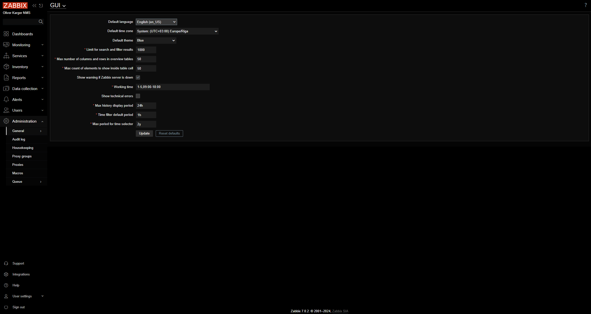
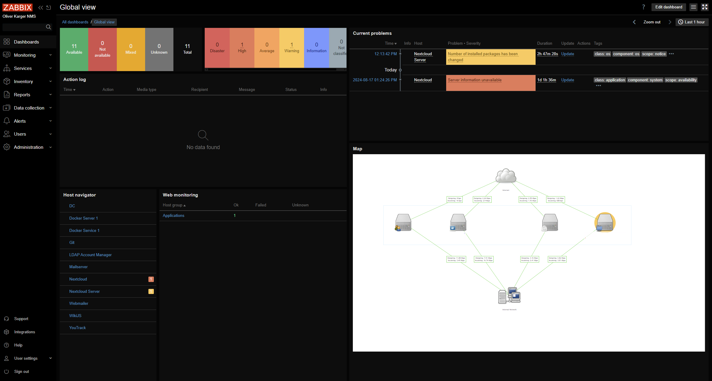
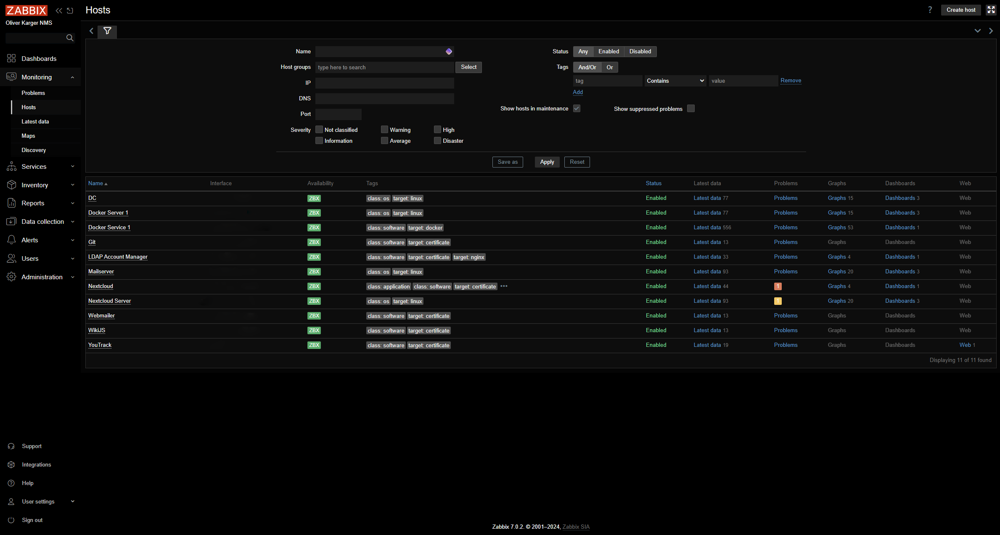

# Zabbix-TrueBlack

TrueBlack/OLED optimized Theme for Zabbix

## How to install:

<h3 id="theme_install_docker">Docker</h3>
- Mount `Zabbix-TrueBlack.css` to `/usr/share/zabbix/assets/styles/Zabbix-TrueBlack.css`
- Mount `APP-override.php` to `/usr/share/zabbix/include/classes/core/APP.php`

<h3 id="theme_install_package">Package Installation</h3>
Same Paths as for <a href="#theme_install_docker">Docker Installation</a>, just copy Files.

### Graph Theme

<h3 id="graph_theme_install_docker">Docker</h3>
1. Open Shell inside Docker Container: `docker exec -it ZabbixDatabase bash`
2. Execute Transaction in [GraphTheme.sql](database/GraphTheme_Add.sql):
    - Execute File Directly: `psql -U <user> -W <password> -f <path_to_GraphTheme.sql>`
    - Execute Command:
        1. `psql -U <user> -W <password>`
        2. Copy Content of `GraphTheme.sql`, insert and execute into psql Shell

<h4 id="graph_theme_install_package">Package Installation</h4>
- Execute File Directly: `psql -U <user> -W <password> -f <path_to_GraphTheme.sql>`
- Execute Command:
    1. `psql -U <user> -W <password>`
    2. Copy Content of `GraphTheme.sql`, insert and execute into psql Shell

#### Update Theme
To Update the Theme, use the `database/GraphTheme_Update.sql` instead of `database/GraphTheme_Add.sql`

Repeat Steps from <a href="#graph_theme_install_docker">Docker</a> or <a href="#graph_theme_install_package">Package Install</a>

## Screenshots

### Settings Page

### Dashboard

### Hosts Overview
